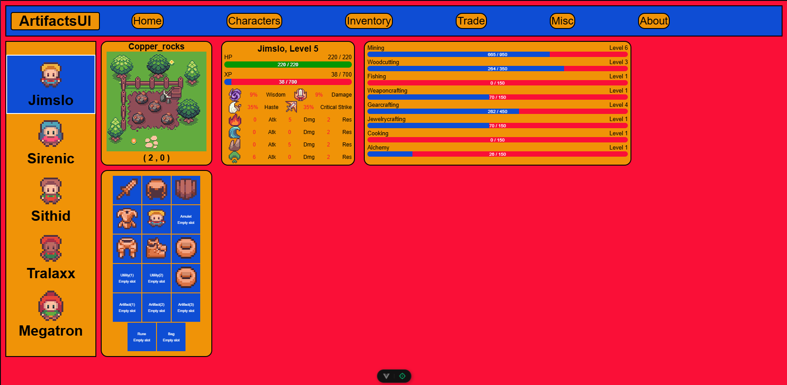

# artifacts-api-tools

Various tools, utilities, & frontends, etc for the ArtifactsMMO API.

## Languages & Technologies Used

- JavaScript
- Node.js
- VueJS 3

## Recently Started

- CLI: Command line interface to play the game.
- GUI: VueJS frontend client to play the game.

## Vue Frontend Progress

Character page is what I am currently working on.


## Running

Clone the repo and execute `npm install` inside `./client`,`./cli`, and `./shared`.  
Execute `npm run dev` inside `./client` or `node main.js` inside `./cli`.

You will notice that `secrets.js` is missing from the root directory of the repo. You will need to create your own ( touch secrets.js ) and add your own api key and characters:

```
// artifact-api-tools-js/secrets.js
export const API_TOKEN = "ARTIFACTS_API_TOKEN_GOES_HERE"
export const API_CHARS = [
  {
    name: 'char1'
  },
  {
    name: 'char2'
  },
  {
    name: 'char3'
  },
  {
    name: 'char4'
  },
  {
    name: 'char5'
  }
];
```

I strongly suggest that you add your own `secrets.js` to `.gitignore` if you plan to commit to github.  
Never commit sensitive information like api keys.
